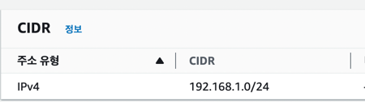
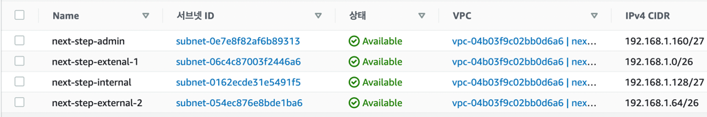
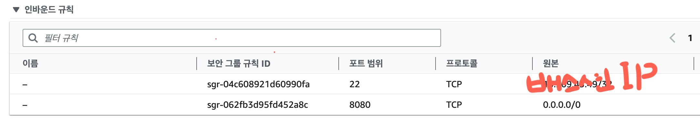

## Bastion을 이용한 망 구성

### Bastion
**Bastion** 이란, 성 외곽을 보호하기 위해 돌출된 부분으로 적으로부터 효과적으로 방어하기 위한 수단이다. 이를 우리의 아키텍쳐에도 적용해볼 수 있다.  

Bastion 이란, 성 외곽을 보호하기 위해 돌출된 부분으로 적으로부터 효과적으로 방어하기 위한 수단입니다. 이를 우리의 아키텍쳐에도 적용해볼 수 있습니다.

가령, 우리가 터미널에 접속하기 위해 사용하는 22번 포트를 한번 생각해보자. 22번 포트의 경우 **보안이 뚫린다면 서비스에 심각한 문제**를 일으킬 수 있다. 그렇다고, 모든 서버에 동일 수준의 보안을 설정하고자 한다면, Auto-Scaling 등 확장성을 고려한 구성과 배치된다. 이 경우 관리 포인트가 늘어나기에 일반적으로는 보안 설정을 일정 부분을 포기하는 결정을 하게 된다. 만약 Bastion Server가 있다면, 악성 루트킷, 랜섬웨어 등으로 피해를 보더라도 Bastion Server만 재구성하면 되므로, 서비스에 영향을 최소화할 수 있다.
추가적으로, 서비스 정상 트래픽과 관리자용 트래픽을 구분할 수 있다는 이점이 있다. 가령, 서비스가 DDos 공격을 받아 대역폭을 모두 차지하고 있다면 일반적인 방법으로 서비스용 서버에 접속하기는 어렵기 때문에 별도의 경로를 확보해둘 필요가 있다.

따라서, 22번 Port 접속을 Bastion 서버에 오픈하고 그 서버에 보안을 집중하는 것이 효율적이다.  

### 실습  
해당 실습은 간단한 실습으로 외부망에 위치한 WAS와 이를 접근 통제할 Bastion 서버를 구축하는 예시를 보여주겠습니다. 

**1. VPC 생성**

- 실습용 VPC를 생성합니다. 
- 실습용 이기 때문에 CIDR은 C클래스(x.x.x.x/24)로 생성합니다.
- 필자는 192.168.1.0/24로 생성하였습니다.

**2. Subnet 생성**  

- 외부망(next-step-external)용 Subnet 64개 씩 1개를 생성합니다.
- 관리용(next-step-admin) Subnet 32씩 1개를 생성합니다.
- 내부망(next-step-internal)용 Subnet 32씩 1개를 생성합니다.(이후 실습을 위해)
- [서브네팅 참고](https://www.ipaddressguide.com/cidr)  
  
**3. Internet Gateway 연결**
- VPC 내에 있는 인스턴스들이 외부와 통신하기 위해 인터넷 게이트웨이를 생성하고 해당 VPC와 연결합니다.  
  
**4. Route Table**  
- 해당 VPC 내의 서브넷끼리 통신하기 위해 라우트 테이블을 생성합니다.
  
**5. 보안 그룹 생성**  
- 외부망을 위한 보안그룹을 생성합니다. 
  - 일단 현재 실습에서는 WAS를 외부망에 배포할 것이기 때문에 전체대역에 대해여 8080포트를 오픈합니다.
  - 이후 Bastion이 구축되면 Bastion IP에 대하여만 22번 포트를 오픈합니다.
- 내부망을 위한 보안그룹을 생성합니다(인스턴스 생성 후, 이후 실습용).
  - 현재 실습에서는 내부망을 DB(Mysql)로 사용할 것이기 때문에 3306포트에 대하여 해당 DB를 사용하는 WAS IP에 대하여만 오픈합니다.
  - 이후 Bastion이 구축되면 Bastion IP에 대하여만 22번 포트를 오픈합니다.
- 관리망을 위한 보안그룹을 생성합니다.
  - 자신 데스크탑 IP에 대하여만 22번포트를 오픈합니다.

**6. 서버 생성**
- WAS로 사용할 EC2 생성 (퍼블릭 IP 활성화)
- Bastion으로 사용할 EC2 생성 (퍼블릭 IP 활성화)
- 처음에는 각각 인스턴스에 터미널로 들어가 설정을 해야되기 때문에 22번 포트를 모든 대역에서 오픈하도록 생성합니다.

**7. WAS, Bastion 접근 통제**
```shell
## Bastion Server에서 공개키를 생성합니다.
bastion $ ssh-keygen -t rsa
bastion $ cat ~/.ssh/id_rsa.pub

## 접속하려는 서비스용 서버(WAS)에 키를 추가합니다.
$ vi ~/.ssh/authorized_keys

## Bastion Server에서 접속을 해봅니다.
bastion $ ssh ubuntu@[서비스용 서버 IP]  
```  

Bastion, WAS 키 설정 후
- Bastion Server는 자신의 공인 IP에서만 22번 포트로 접근이 가능하도록 Security Group을 설정합니다.
- 서비스용 서버에 22번 포트로의 접근은 Bastion 서버에서만 가능하도록 Security Group을 설정합니다.
  
**결과**
- Bastion 서버 인바운드

- WAS 서버 인바운드

- Bastion 접근 - 내 데스크탑에서만 22번 포트로 접근이 가능하다.
- WAS 접근  
  - Bastion 서버에서만 22번 포트로 접근이 가능하다. (내 데스크탑 -> Bastion -> WAS)
  - 8080번 포트에 대해서는 모든 IP 오픈